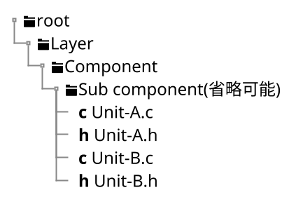
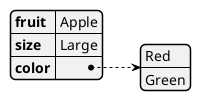
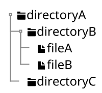

<!----------------------------------------------------------------------------
 #
 #  Requirements:
 #      Editor:
 #          VSCode 1.68.0
 #      HTML viewer:
 #          Chrome 105.0.5195.127
 #      Generation environment for HTML:
 #          VSCode Add-in Markdown Preview Enhanced v0.6.3
 #          Graphviz Version.
 #          Java 17 LTS
 #
 #  Reference:
 #      Markdown Preview Enhanced 
 #          https://shd101wyy.github.io/markdown-preview-enhanced/#/
 #
 #          文法(Markdown拡張表現を含む)
 #              https://shd101wyy.github.io/markdown-preview-enhanced/#/markdown-basics
 #
 #          サポートするダイアグラム形式(PlantUML以外もサポート有り)
 #              https://shd101wyy.github.io/markdown-preview-enhanced/#/diagrams
 #
 #---------------------------------------------------------------------------->
<!----------------------------------------------------------------------------
 # Section    : Definition
 # Description: meta内で定義した値を文書内で{meta.定義名}の形で参照可能です。
 #---------------------------------------------------------------------------->
<script>
const meta = {
    documentName: "Architecture Design",          // 文書名
    documentID:"documentID",                // 文書ID
    version: "00",                          // バージョン
    system: "System",                       // システム
    vehicle: "Vehicle",                     // 車両
    customer: "Customer",                   // 顧客
    asil: "QM",                             // ASIL
    issued: "Publisher Name"                // 版権
};
</script>

<!----------------------------------------------------------------------------
 # Section    : main
 # Description: 文書化したい内容を記述する領域です。
 #---------------------------------------------------------------------------->

# 1. Document information

Document Name
: {meta.documentName}

Document ID
: {meta.documentID}

Version
: {meta.version}

System
: {meta.system}

Vehicle
: {meta.vehicle}

Customer
: {meta.customer}

ASIL
: {meta.asil}

Issued by
: {meta.issued}

# 2. History

| Version | Issued date | Content     |
| :------ | :---------- | :---------- |
| 00      | 2022-00-00  | New release |

# 3. Introduction

## 3.1. Purpose

## 3.2. Scope

## 3.3. Reference

# 4. Design policy

ソフトウェアーキテクチャ設計における基本的な考え方を示す。

## 4.1. Software element hierarchy

### 4.1.1. Software element

ソフトウェアを構成するエレメント(要素)は以下の4種に大別される。

```plantuml

class Layer << (L,pink) >> {
    ソフトウェアを構成するエレメント群において、最も上位の階層。
    処理を制御対象の具現化のレベル(MCU、IC、メカ)ごとに階層化し次のレベルに引き渡していく設計とすることで、制御対象の変化(マイコン変更、IC変更、メカ変更)に柔軟に対応することを目的とする。
    ---
    最上位レイヤーは
    * Application layer
    * Middleware layer
    * Interface layer
    * Platform layer
    * FTPF ( **F**actory **T**esting **P**lat**f**orm )
    * Common package
    に大別され、Platform layerは更に
    * AUTOSAR
    * Complex driver
    * Microcontroller abstraction layer
    に分割される。
    下位階層のソフトウェアエレメントは、必ず上記いずれかに属する。
}

```

```plantuml

class Component << (C, lightgreen) >> {
    ソフトウェアシステムの機能を関心の分離によって分割したエレメントであり、
    分割されたエレメントはソフトウェアを構成する部品である。
    ---
    ソフトウェアエレメントを部品単位(例として、A/Dコンバータ、I/Oポート、データフラッシュドライバ、作動制御)に分割することで、
    個々の部品を実装してから最終的に1つのソフトウェアとして組み上げることが可能となる。
    **なお、コンポーネントの規模に応じ、コンポーネント内部にコンポーネントを持つことも可能である(サブコンポーネント)。**
}

```

```plantuml

class Unit << (U,yellow) >> {
    部品としての機能を提供可能かつ分割可能な最小単位のエレメント。
    -----
    C言語ではファイル単位で関数や変数の可視範囲を定義することが可能であるため、
    ユニットのソフトウェア実装上の単位はファイル(.c)であることが望ましい。
}

```

```plantuml

class Function << (F,skyblue) >> {
    C言語実装における関数。
    -----
    関数単体は必ずしも部品としての機能を提供しない。(子タスクをコールするだけのタスク関数等)
}
```

なお、レイヤーに属するコンポーネントが多い場合はコンポーネントの特性に応じて適度にグルーピングしてもよい。**これを便宜的にComponent group(コンポーネントグループ)と呼ぶものとする。**
一例として、AUTOSARコンポーネントのCanTrcv、CanIf、ComMなど通信に関わるコンポーネントをまとめてCommunication Stackと呼ぶことが該当する。
コンポーネントグループはあくまで設計理解の助けとするためのものであり、それ以上の意味は持たない。

### 4.1.2. Hierarchy structure

各ソフトウェアエレメントの階層関係は以下の通りとなる。

```plantuml
skinparam componentStyle rectangle
Frame "Layer" {
    Folder "Component group(省略可能)"{
        Folder "Component"{
            Folder "Sub component(省略可能)"{
                File "Unit"{
                    [Function]
                }
            }
        }
    }
}
```

ディレクトリ階層もソフトウェアエレメントの階層関係に合わせて配置することを強く推奨する。
※上記を逸脱する場合その合理性を文書化する。またサードパーティー及びレガシーソフトウェア、コンポーネントグループはこの限りではない



## 4.2. Layered design

下図において下に行くほど低レベルレイヤー(ハードウェア)、上に行くほど高レベルレイヤー(アプリケーション)である。
レイヤーを飛び越えてインターフェース又はリソースを利用することは禁止する。ただし、例外的にCommon packageは全てのレイヤーからアクセス可能とする。

なお、FTPFは製品ソフトウェアとは完全に独立したソフトウェアであるため、起動時タイミングのみPlatform layerに依存する。

```ditaa {cmd=true args=["-E"]}
                    /------------------------------\
                    |                              |
                    v                              |
+--------+   +------*-+   +-----------------+   +--+--------------+ 
| FTPF   |   | Common |   | Application     |   | Middleware      | 
|        |   | Package|<--+ Layer(APL) cAAA |   | Layer(MDW) cAAA | 
|        |   | (CMN)  |   +----+-*----------+   +-+-*-------------+
|        |   |        |        | ^                | ^
|        |   |        |        v |                v |
|        |   |        |   +----*-+----------------*-+-------------+ 
|        |   |        |   | Interface Layer(RTE,PAL)         cAAA |
|        |   |        |   +----------------+-*--------------------+
|        |   |        |                    | ^
|        |   |        |                    v |
|        |   |        |   +----------------*-+--------------------+
|        |   |  cAAA  *<--+ Platform Layer                        |
|        *<--+--------+---+ (PF)                             cAAA |
|        |   |        |   +----------------+-*--------------------+
|        |   |        |                    | ^
|        |   |        |                    v |
|        |   |        |   +----------------*-+--------------------+
|        |   |        *<--+ Microcontroller abstraction Layer     |
|  cAAA  |   |  cAAA  |   | (MCAL) Notice: A part of PF      cAAA |
+--+-*---+   +--------+   +----------------+-*--------------------+
   | ^                                     | ^
   v |                                     v |
+--*-+-------------------------------------*-+-------------------+ 
| cAAA Microcontroller(Hardware)                                 | 
+----------------------------------------------------------------+ 

```

各レイヤーの役割を以下に示す。

Microcontroller abstraction layer(MCAL)
: マイクロコントローラー(マイコン)を抽象化する層。
  他レイヤーに対してマイコンを意識させないことで、以下が可能となる。

  * マイコン変更時の影響範囲局所化
  * マイコン制約の調査範囲局所化
  
Platform layer(PF)
: アプリケーションを実行するためのソフトウェア基盤である。
  MCALもPFの一部である。(※便宜上、インタフェースアクセスルールの定義ため分離して表記)
  Platform layerは更に以下に分割可能である。

  | Name           | Description                                     |
  | :------------- | :---------------------------------------------- |
  | Complex driver | ECU上に実装されたIC、アクチュエータを抽象化する |

Interface layer
: N/A

Middleware layer
: N/A

Application layer
: N/A

Common package
: N/A

FTPF
: N/A

## 4.3. Plug-in oriented

AUTOSARアーキテクチャにおけるSW-C、すなわちInterface Layerより上位レイヤ(Application、Middleware)に属するコンポーネントは、同一コンポーネント内であっても相互のインタフェース利用を禁止する。
コンポーネントの提供・要求インタフェースは、必ずInterface Layerと接続する必要がある。

ソフトウェアコンポーネント同士の依存関係を断ち切り、抜き差し可能なプラグインとしてコンポーネントを提供することを目的とする。

```ditaa {cmd=true args=["-E"]}

+----------------------------------------------+
| Application layer                            | 
|  +-------------+           +-------------+   |
|  | Component A +=---X----->| Component A |   |
|  |             |           |             |   |
|  |        cCCC |<---X-----=+        cBBB |   |
|  |             |           |             |   |
|  +--+--*-------+           +--+--*-------+   |
|     |  ^                      |  ^           |
|     |  |                      |  |           |
+-----|--|----------------------|--|-----------+
      |  |                      |  |
      v  |                      v  |
+-----*--+----------------------*--+-----------+
| cAAA Interface layer                         | 
|                                              | 
+----------------------------------------------+

```

## Knowhow

インタフェース設計において汎用ポインタの使用は極力避ける
: 過去の経験から、

依存方向は極力高レベルレイヤから低レベルレイヤに向ける
: 


## 4.4. Third party software

第三者からの供給ソフトウェアに対する扱いを示す。

## 4.5. Legacy software

レガシーソフトウェアに対する扱いを示す。

## 4.6. Application parameter

アプリケーションパラメータに対する扱いを示す。


## 4.7. Computational resource

アーキテクチャ設計の選択肢が複数ある場合において、計算資源の観点における優先度(可能な限り節約したい資源)は以下の通りである。

1. 処理時間
   1.1. 周期処理時間
   1.2. 初期化処理時間
2. 揮発性メモリ
   2.1. スタックメモリ
   2.2. 静的メモリ
3. 不揮発性メモリ
   3.1. コードフラッシュ
   3.2. データフラッシュ

なお、本製品ではRAMとしてヒープメモリは利用しない。
ヒープメモリを利用しなければならない程膨大なメモリ領域を必要としないことに加え、メモリリークの発生やリソースオーバーフローによる不具合を防止するためである。

# 5. Design strategy

設計戦略を以下に示す。

## 5.1. Vehicle X Phase X

本製品として初のソフトウェア開発である。今後の{meta.system}のベースラインとなるため、構造化

### 5.1.1. Risk

マイコン変更が発生する可能性がある。

### 5.1.2. Evaluation of architecture alternatives 


# 6. Architectural design

## 6.1. Software block diagram


## 6.2. Startup general flow


## 6.3. Task design

## 6.4. Functional design


## 6.5. Interface-A

Prototype
:  ```c
   int main( void );
   ```

Arguments
:  void


Return value
:  | a | b |
   |:--|---|
   | b | c |

Description
:  N/A

Context
:  N/A

Limitation
:  N/A


# 6. How to use this document

## 6.1. 表を外部のcsvファイルからインポートする例

@import "./sample.csv"

## 6.2. 表の結合を行う例

| left | center | right |
| :--- | :----: | ----: |
| >    |   >    |     A |
| B    |   C    |     D |
| E    |   ^    |     F |

## 6.3. ダイアグラムの作成例

### 6.3.1. 静的ダイアグラム

#### 6.3.1.1. クラス図


```plantuml

class classA {
    ID;;AAA-BBB-CCC
    REF;;DDD-EEE-FFF
    ---
    XXの責務を持つクラスです。
    ---
    + f_tsk_interfaceA( void )
    + f_get_interfaceB( void )
    + f_set_interfaceC( void )
}

class classB {
    ID;;AAA-BBB-CCC
    REF;;DDD-EEE-FFF
    ---
    YYの責務を持つクラスです。
    ---
    + f_tsk_interfaceA( void )
    + f_get_interfaceB( void )
    - f_set_interfaceC( void )
}

class classC {
    ID;;AAA-BBB-CCC
    REF;;DDD-EEE-FFF
    ---
    ZZの責務を持つクラスです。
    ---
    + f_tsk_interfaceA( void )
    + f_get_interfaceB( void )
    - f_set_interfaceC( void )
}

classA -> classB
classC --> classB

```


### 6.5.1. 任意の図(自由度高いけど、追加削除のメンテコスト大)

```ditaa {cmd=true args=["-E"]}
+--------+   +-------+    +-------+
|        | --+ ditaa +--> |       |
|  Text  |   +-------+    |diagram|
|Document|   |!magic!|    |       |
|     {d}|   |       |    |       |
+---+----+   +-------+    +-------+
    :                         ^
    |       Lots of work      |
    +-------------------------+
```

### 6.5.2. データ構造(json)



### 6.5.3. 階層構造



### 6.5.4. 動的ダイアグラム

#### 6.5.4.1. アクティビティ図

```plantuml
start
repeat
  :Test something;
    if (Something went wrong?) then (no)
      #palegreen:OK;
      break
    endif
    ->NOK;
    :Alert "Error with long text";
repeat while (Something went wrong with long text?) is (yes) not (no)
->//merged step//;
:Alert "Success";
stop
```

#### 6.5.4.2. 状態遷移図

```plantuml
scale 350 width
[*] --> NotShooting

state NotShooting {
  [*] --> Idle
  Idle --> Configuring : EvConfig
  Configuring --> Idle : EvConfig
}

state Configuring {
  [*] --> NewValueSelection
  NewValueSelection --> NewValuePreview : EvNewValue
  NewValuePreview --> NewValueSelection : EvNewValueRejected
  NewValuePreview --> NewValueSelection : EvNewValueSaved

  state NewValuePreview {
     State1 -> State2
  }

}
```

#### 6.5.4.3. シーケンス図

```plantuml
autoactivate on


actor User
control "Job\nWorkspace" as Job
Entity Artifact

User -> Job : build with parameter
Job -> Job : Clean workspace
return {meta.documentName}
Job ->  Artifact : Copy: schedule.csv
```

### 6.5.5. タイミングチャート

```plantuml
concise "Client" as Client
concise "Server" as Server
concise "Response freshness" as Cache

Server is idle
Client is idle

@Client
0 is send
Client -> Server@+25 : GET
+25 is await
+75 is recv
+25 is idle
+25 is send
Client -> Server@+25 : GET\nIf-Modified-Since: 150
+25 is await
+50 is recv
+25 is idle
@100 <-> @275 : no need to re-request from server

@Server
25 is recv
+25 is work
+25 is send
Server -> Client@+25 : 200 OK\nExpires: 275
+25 is idle
+75 is recv
+25 is send
Server -> Client@+25 : 304 Not Modified
+25 is idle

@Cache
75 is fresh
+200 is stale
```


<!----------------------------------------------------------------------------
 # Section    : テンプレート
 # Description: 変更不要です。
 #---------------------------------------------------------------------------->
<header id="header"><div id="title">{meta.documentName}</div><div id="document_info"><div id="document_id">{meta.documentID}-{meta.version}</div><div id="version">{meta.version}</div></div></header>
<footer id="footer">- {meta.issued} -</footer>
<style> header { position:fixed !important; height:60px; width:100%; z-index:3000; top:0px; left:0px; background-color:white; border-bottom: 1px solid gray; box-sizing: border-box; } #title { padding-left:0.5em; font-size:20px; font-weight:bold; } #document_info{ display:block; position:fixed; top:0.5em; right:1em; font-weight:bold; color:darkgray; font-size:14px; text-align:right;} #document_id::before{content:"DOCUMENT ID: "} #version{ display:inline; } #version::before{content:"VERSION: "} footer { position:fixed; bottom:0px; ;left:0px; width:100%; height:20px; z-index:3500; background-color:white; border-top: 1px solid slategray; text-align:center; font-size:15px; color:#333;} .md-sidebar-toc{ padding-top:60px !important;}</style>
<script>
Object.keys(meta).forEach(function (key) { document.getElementsByTagName("body")[0].innerHTML = (document.getElementsByTagName("body")[0].innerHTML).replaceAll("{meta."+key+"}",meta[key]);});
</script>

<!----------------------------------------------------------------------------
 # EOF
 #---------------------------------------------------------------------------->
