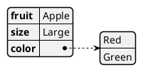
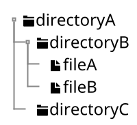

<!----------------------------------------------------------------------------
 #
 #  Requirements:
 #      Editor:
 #          VSCode 1.68.0
 #      HTML viewer:
 #          Chrome 105.0.5195.127
 #      Generation environment for HTML:
 #          VSCode Add-in Markdown Preview Enhanced v0.6.3
 #          Graphviz Version.
 #          Java 17 LTS
 #
 #  Reference:
 #      Markdown Preview Enhanced 
 #          https://shd101wyy.github.io/markdown-preview-enhanced/#/
 #
 #          文法(Markdown拡張表現を含む)
 #              https://shd101wyy.github.io/markdown-preview-enhanced/#/markdown-basics
 #
 #          サポートするダイアグラム形式(PlantUML以外もサポート有り)
 #              https://shd101wyy.github.io/markdown-preview-enhanced/#/diagrams
 #
 #---------------------------------------------------------------------------->
<!----------------------------------------------------------------------------
 # Section    : Definition
 # Description: meta内で定義した値を文書内で{meta.定義名}の形で参照可能です。
 #---------------------------------------------------------------------------->
<script>
const meta = {
    documentName: "Document Name",          // 文書名
    documentID:"documentID",                // 文書ID
    version: "00",                          // バージョン
    system: "System",                       // システム
    vehicle: "Vehicle",                     // 車両
    customer: "Customer",                   // 顧客
    asil: "QM",                             // ASIL
    issued: "Publisher Name"                // 版権
};
</script>

<!----------------------------------------------------------------------------
 # Section    : main
 # Description: 文書化したい内容を記述する領域です。
 #---------------------------------------------------------------------------->

# 1. Document information

Document Name
: {meta.documentName}

Document ID
: {meta.documentID}

Version
: {meta.version}

System
: {meta.system}

Vehicle
: {meta.vehicle}

Customer
: {meta.customer}

ASIL
: {meta.asil}

Issued by
: {meta.issued}

# 2. History

| Version | Issued date | Content     |
| :------ | :---------- | :---------- |
| 00      | 2022-00-00  | New release |

# 3. How to use this document

## 3.1. 表を外部のcsvファイルからインポートする例

@import "./sample.csv"

## 3.2. 表の結合を行う例

| left | center | right |
| :--- | :----: | ----: |
| >    |   >    |     A |
| B    |   C    |     D |
| E    |   ^    |     F |

## 3.3. ダイアグラムの作成例

### 3.3.1. 静的ダイアグラム

#### 3.3.1.1. クラス図


```plantuml

class classA {
    ID;;AAA-BBB-CCC
    REF;;DDD-EEE-FFF
    ---
    XXの責務を持つクラスです。
    ---
    + f_tsk_interfaceA( void )
    + f_get_interfaceB( void )
    + f_set_interfaceC( void )
}

class classB {
    ID;;AAA-BBB-CCC
    REF;;DDD-EEE-FFF
    ---
    YYの責務を持つクラスです。
    ---
    + f_tsk_interfaceA( void )
    + f_get_interfaceB( void )
    - f_set_interfaceC( void )
}

class classC {
    ID;;AAA-BBB-CCC
    REF;;DDD-EEE-FFF
    ---
    ZZの責務を持つクラスです。
    ---
    + f_tsk_interfaceA( void )
    + f_get_interfaceB( void )
    - f_set_interfaceC( void )
}

classA -> classB
classC --> classB

```


### 3.3.2. 任意の図(自由度高いけど、追加削除のメンテコスト大)

```ditaa {cmd=true args=["-E"]}
+--------+   +-------+    +-------+
|        | --+ ditaa +--> |       |
|  Text  |   +-------+    |diagram|
|Document|   |!magic!|    |       |
|     {d}|   |       |    |       |
+---+----+   +-------+    +-------+
    :                         ^
    |       Lots of work      |
    +-------------------------+
```

### 3.3.3. データ構造(json)



### 3.3.4. 階層構造



### 3.3.5. 動的ダイアグラム

#### 3.3.5.1. アクティビティ図

```plantuml
start
repeat
  :Test something;
    if (Something went wrong?) then (no)
      #palegreen:OK;
      break
    endif
    ->NOK;
    :Alert "Error with long text";
repeat while (Something went wrong with long text?) is (yes) not (no)
->//merged step//;
:Alert "Success";
stop
```

#### 3.3.5.2. 状態遷移図

```plantuml
scale 350 width
[*] --> NotShooting

state NotShooting {
  [*] --> Idle
  Idle --> Configuring : EvConfig
  Configuring --> Idle : EvConfig
}

state Configuring {
  [*] --> NewValueSelection
  NewValueSelection --> NewValuePreview : EvNewValue
  NewValuePreview --> NewValueSelection : EvNewValueRejected
  NewValuePreview --> NewValueSelection : EvNewValueSaved

  state NewValuePreview {
     State1 -> State2
  }

}
```

#### 3.3.5.3. シーケンス図

```plantuml
autoactivate on


actor User
control "Job\nWorkspace" as Job
Entity Artifact

User -> Job : build with parameter
Job -> Job : Clean workspace
return {meta.documentName}
Job ->  Artifact : Copy: schedule.csv
```

### 3.3.6. タイミングチャート

```plantuml
concise "Client" as Client
concise "Server" as Server
concise "Response freshness" as Cache

Server is idle
Client is idle

@Client
0 is send
Client -> Server@+25 : GET
+25 is await
+75 is recv
+25 is idle
+25 is send
Client -> Server@+25 : GET\nIf-Modified-Since: 150
+25 is await
+50 is recv
+25 is idle
@100 <-> @275 : no need to re-request from server

@Server
25 is recv
+25 is work
+25 is send
Server -> Client@+25 : 200 OK\nExpires: 275
+25 is idle
+75 is recv
+25 is send
Server -> Client@+25 : 304 Not Modified
+25 is idle

@Cache
75 is fresh
+200 is stale
```

# 4. Introduction

## 4.1. Purpose

## 4.2. Scope

## 4.3. Reference

## 4.4. Term definition

*[HTML]: Hyper Text Markup Language
*[W3C]: World Wide Web Consortium

↑こんな感じで用語定義すると(見えないけど)、↓のように注釈がつく。

The HTML specification
is maintained by the W3C.


# 6. Software API

## 6.1. Interface-A

```c
int main( void );
```


<!----------------------------------------------------------------------------
 # Section    : テンプレート
 # Description: 変更不要です。
 #---------------------------------------------------------------------------->
<header id="header"><div id="title">{meta.documentName}</div><div id="document_info"><div id="document_id">{meta.documentID}-{meta.version}</div><div id="version">{meta.version}</div></div></header>
<footer id="footer">- {meta.issued} -</footer>
<style> header { position:fixed !important; height:60px; width:100%; z-index:3000; top:0px; left:0px; background-color:white; border-bottom: 1px solid gray; box-sizing: border-box; } #title { padding-left:0.5em; font-size:20px; font-weight:bold; } #document_info{ display:block; position:fixed; top:0.5em; right:1em; font-weight:bold; color:darkgray; font-size:14px; text-align:right;} #document_id::before{content:"DOCUMENT ID: "} #version{ display:inline; } #version::before{content:"VERSION: "} footer { position:fixed; bottom:0px; ;left:0px; width:100%; height:20px; z-index:3500; background-color:white; border-top: 1px solid slategray; text-align:center; font-size:15px; color:#333;} .md-sidebar-toc{ padding-top:60px !important;}</style>
<script>
Object.keys(meta).forEach(function (key) { document.getElementsByTagName("body")[0].innerHTML = (document.getElementsByTagName("body")[0].innerHTML).replaceAll("{meta."+key+"}",meta[key]);});
</script>

<!----------------------------------------------------------------------------
 # EOF
 #---------------------------------------------------------------------------->
